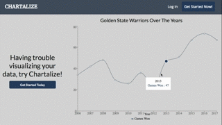
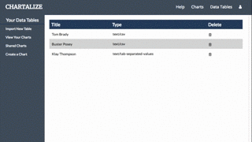
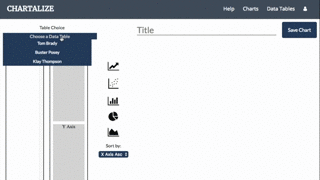
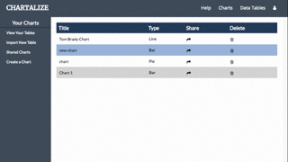

# Chartalize

[Chartalize](http://chartalize.com) is a web application for users to build charts and perform simple data analysis using uploaded data tables. Inspired by Chartio, Chartalize allows users to upload data sources, generate charts and share generated charts with fellow users.

Chartalize is a personal project by Li Hsuan Lu.

## Features

- Hosting on Heroku
- New account creation and login
- Guest/demo account
- Upload data and visualize it with a variety of charts
- Logged in users can persist their data
- Supports JSON, TSV and CSV formats
- Users can share generated charts with other users

## Design Features

At the homepage, a simple, minimal splash page is displayed with an example of a chart generated through Chartalize. Users can either choose to login using an existing account, signup with a new account or experience the features using a demo account.



Upon login, users are greeted with the list of data tables they have previously uploaded. If they have not uploaded a data table, they are prompted to do so. Contents of the data table can also be viewed by clicking on its title.



Users can also create a multitude of charts, and sort by x and y axes, ascending and descending.



After the chart is created, it can then be shared with other users.



## Code Snippets

Here, I share some of the critical parts of my code that brings the application together.

- File Parsing

  For TSV and CSV files, they are broken into separate elements based on their respective delimiters. For JSON files, the built-in JSON parser is used.
```javascript
  let table = [];
  const allTextLines = data.split(/\r\n|\n/);
  let delim = "";
  if(data_type === "text/csv"){
    delim = ',';
  }else if(data_type ==="text/tab-separated-values"){
    delim = '\t';
  }

  if(data_type === "application/json"){
    table = JSON.parse(data);
  }else{
    let headings = allTextLines[0].split(delim);
    for(let i = 1; i< allTextLines.length; i++){
      let currentLine = allTextLines[i].split(delim);
      let rowData = {};
      for(let j = 0; j<currentLine.length; j++){
        rowData[headings[j]] = currentLine[j];
      }
      if(values(rowData).length > 1){
        table.push(rowData);
      }
    }
  }
```

- Data filtering

  Filtering of data by current user was also moved from frontend to backend for speed considerations. Here's an example the code before and after the shift.

  Before:
  ```javascript
  export const selectCurrentUserCharts = (charts,currentUser) => {
    let currentUserCharts = [];
    for(let key in charts){
      if(charts[key].user_id === currentUser.id){
        currentUserCharts.push(charts[key]);
      }
    }
    return currentUserCharts;
  };
  ```

  After:
  ```ruby
  def index
    allcharts = Chart.all
    @charts = []
    allcharts.each do |chart|
      @charts.push(chart) if chart.user.id == current_user.id
    end
    render :index
  end
  ```

- Data Parsing for Charts

  Data is processed row by row, extracting out the information corresponding to the selected x and y axes. Y values with identical x values are averaged, while different errors are also returned if undesirable data is selected.
  ```javascript
  let currentTable = this.state.table;
  let yData = [];
  let xData = [];
  for(let key in currentTable){
    //check if x data value is present in that row
    if(keys(currentTable[key]).includes(this.state.xAxis)){
      //check if y data value is present in that row
      if(keys(currentTable[key]).includes(this.state.yAxis)){
        if(isNaN(Number(currentTable[key][this.state.yAxis]))){
          return undefined;
        }else{
          let xDataVal = currentTable[key][this.state.xAxis];
          let ind = xData.indexOf(xDataVal);
          //if same xdataval has been found already;
          if(ind !== -1){
            yData[ind].push(Number(currentTable[key][this.state.yAxis]));
          }else{
            yData.push([Number(currentTable[key][this.state.yAxis])]);
            xData.push(xDataVal);
          }
        }
      }else{
        return "Missing Y Data Values";
      }
    }else{
      return "Missing X Data Values";
    }
  }
  //average out y data with same x data value s
  for(let i = 0; i<yData.length; i++){
    let yDataAvg = 0;
    for(let j = 0; j < yData[i].length; j++){
      yDataAvg += yData[i][j];
    }
    yData[i] = Math.round(yDataAvg/yData[i].length*1000)/1000;
  }
  let data = [];
  for(let i = 0; i <yData.length; i++){
    let rowData = {};
    rowData[this.state.xAxis] = xData[i];
    rowData[this.state.yAxis] = yData[i];
    data.push(rowData);
  }
  ```

## Project Design

Chartalize was designed and built in two weeks.

A [proposal](./docs/README.md) was drafted to help provide an implementation timelines during the development process.

A [database schema](./docs/schema.md) was prepared alongside the design proposal.

## Technology

Chartalize is a single-page application built with a frontend framework of React/Redux and a backend support of Ruby on Rails.

I also used the following components and packages in the project:

- [React DnD](https://github.com/react-dnd/react-dnd)
- [Recharts.js](http://recharts.org/#/en-US/)
- [React Dropzone](https://react-dropzone.netlify.com/)
- [AnimateCSS](https://daneden.github.io/animate.css/)
- [Lodash](https://lodash.com/)
- [React-Modal](https://github.com/reactjs/react-modal)

## Future Implementations

Currently, Chartalize supports data upload three different file types (CSV, TSV, JSON), charting using a single x-axis and y-axis, four sorting methods (x-axis and y-axis, ascending and descending), and chart sharing by username.

The features that will be added later can be found in this [future](./docs/future.md) readme.
